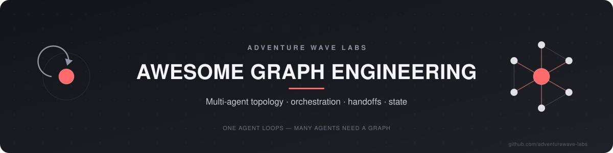
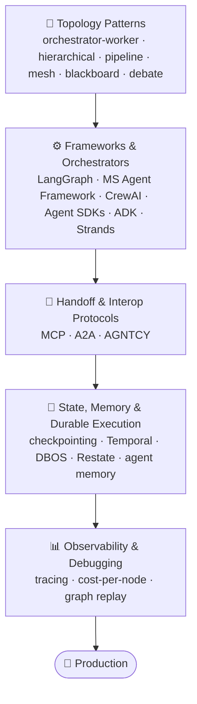
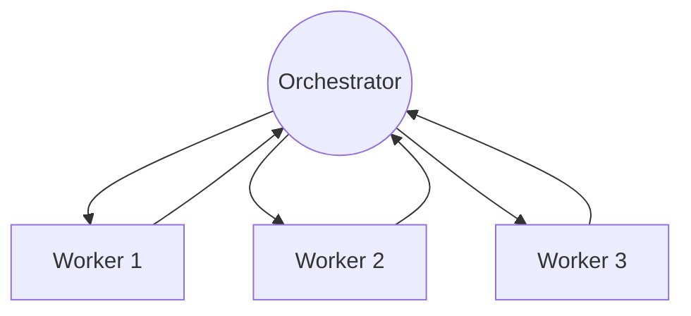
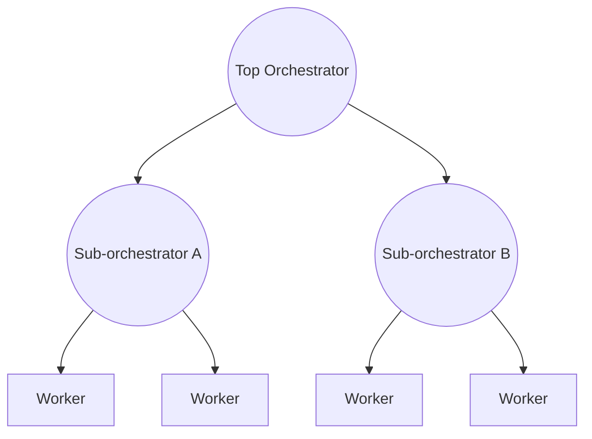
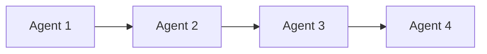
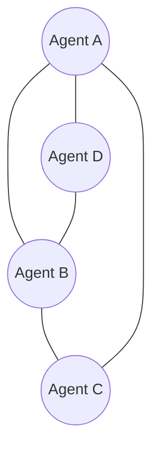
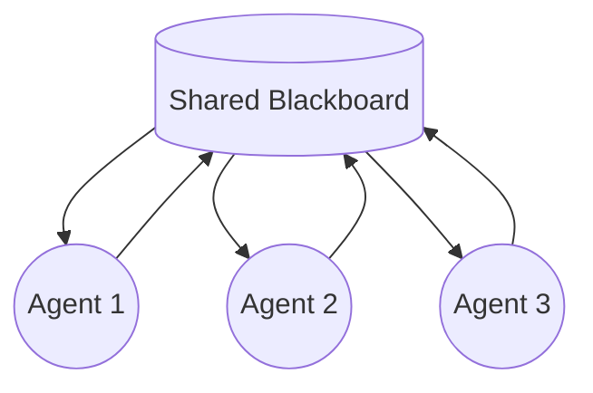
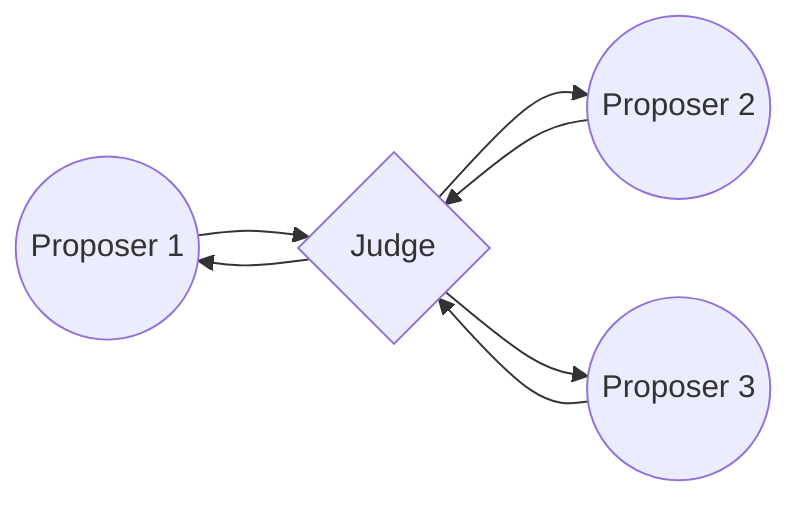

  

# Awesome Graph Engineering 

> One agent loops. More than one needs a graph — topology, handoffs, and state, engineered on purpose instead of improvised at runtime.

A curated list of resources for designing multi-agent AI systems as graphs: the topology patterns that define who talks to whom, the frameworks and protocols that implement them, the state layer that survives a crash, and the observability to debug a graph once it's live. This is about *orchestration* — wiring more than one agent or node into a controlled system. Single-agent autonomous loops live in the sibling list, [awesome-loop-engineering](https://github.com/adventurewave-labs/awesome-loop-engineering); classical graph databases, graph theory, and graph neural networks aren't in scope here at all.

*"Graphs let you encode that structure directly: the valid paths, where the model gets to choose, and where the system should enforce deterministic behavior instead of hoping the model makes the right call every time."* — Harrison Chase & Sydney Runkle, [3 Years of Graph Engineering with LangGraph](https://www.langchain.com/blog/3-years-of-graph-engineering-with-langgraph)

## Contents

- [At a Glance](#at-a-glance)
- [The Canon](#the-canon)
- [Topology Patterns](#topology-patterns)
- [Frameworks & Orchestrators](#frameworks--orchestrators)
- [Handoff & Interop Protocols](#handoff--interop-protocols)
- [State, Memory & Durable Execution](#state-memory--durable-execution)
- [Observability & Debugging](#observability--debugging)
- [Benchmarks & Evaluation](#benchmarks--evaluation)
- [Production Case Studies](#production-case-studies)
- [Related Lists](#related-lists)
- [Contributing](#contributing)

## At a Glance

The sections below, roughly in the order you'll actually need them — pick a topology first, then the framework that implements it, then wire up handoffs, durability, and observability around it.

*(Prefer one image? [View the full infographic](assets/infographic.png) — patterns, stack, and stats in a single sheet.)*

## The Canon

- [Building Effective Agents](https://www.anthropic.com/engineering/building-effective-agents) - The foundational split between "workflows" (LLM steps through predefined code paths) and "agents" (LLMs that direct their own control flow), plus the building-block patterns — including orchestrator-workers — most graph frameworks below now implement. *(Erik Schluntz & Barry Zhang, Anthropic, Dec 2024)*
- [How We Built Our Multi-Agent Research System](https://www.anthropic.com/engineering/multi-agent-research-system) - The production postmortem behind Claude's Research feature: a lead agent orchestrating parallel subagents, and the failure modes that only surface once a topology runs at scale. *(Anthropic, Jun 2025)*
- [When to Use Multi-Agent Systems (and When Not To)](https://claude.com/blog/building-multi-agent-systems-when-and-how-to-use-them) - The counter-argument this canon includes on purpose: splitting into multiple agents only pays off to protect context, parallelize, or specialize — most tasks are still better off single-threaded. *(Anthropic/Claude, Jan 2026)*
- [LangGraph: Multi-Agent Workflows](https://www.langchain.com/blog/langgraph-multi-agent-workflows) - The post that put names on "network," "supervisor," and "hierarchical agent teams" — vocabulary the rest of the field still uses. *(LangChain, Jan 2024)*
- [AutoGen: Enabling Next-Gen LLM Applications via Multi-Agent Conversation](https://arxiv.org/abs/2308.08155) - One of the earliest widely-cited papers to treat a multi-agent system's conversation topology as something you explicitly program, not a fixed loop. *(Wu et al., Microsoft Research, 2023)*
- [3 Years of Graph Engineering with LangGraph](https://www.langchain.com/blog/3-years-of-graph-engineering-with-langgraph) - LangGraph's own creators on why encoding a system as an explicit graph beats hoping the model improvises the right control flow — the essay this list borrows its name from. *(Harrison Chase & Sydney Runkle, Jul 2026 — brand new, not yet a classic, but directly on-topic)*

## Topology Patterns

The shapes multi-agent systems actually take in production. Frameworks in the next section implement one or more of these — pick the pattern before you pick the framework.

### Orchestrator-Worker (Supervisor)

A central agent breaks a task into subtasks, dispatches them to specialized worker agents (often in parallel), and synthesizes their outputs into one result. The default starting topology for most production systems — see it in action under [Production Case Studies](#production-case-studies) before reaching for anything fancier.

Source: [How we built our multi-agent research system](https://www.anthropic.com/engineering/multi-agent-research-system) — Anthropic

### Hierarchical (Manager-of-Managers)

An extension of the supervisor pattern: the top-level orchestrator delegates to entire sub-teams — each with its own supervisor and workers — instead of to individual workers directly. Useful once a single orchestrator's context window or decision surface gets overloaded.

Source: [LangGraph: Multi-Agent Workflows — "Hierarchical Agent Teams"](https://www.langchain.com/blog/langgraph-multi-agent-workflows) — LangChain

### Sequential Pipeline

Agents run in a fixed, linear order, each consuming the previous agent's output — an assembly line of specialized transformations. The simplest topology to reason about and debug; reach for it before anything with cycles or parallel branches.

Source: [AI Agent Orchestration Patterns](https://learn.microsoft.com/en-us/azure/architecture/ai-ml/guide/ai-agent-design-patterns) — Microsoft Azure Architecture Center

### Mesh / Peer-to-Peer (Swarm)

Agents exchange information and hand off work directly to each other with no central controller; overall behavior emerges from decentralized, local interactions. Flexible, but the hardest topology to make deterministic or debug.

Source: [Multi-agent collaboration patterns with Strands Agents and Amazon Nova](https://aws.amazon.com/blogs/machine-learning/multi-agent-collaboration-patterns-with-strands-agents-and-amazon-nova/) — AWS

### Blackboard (Shared-State)

All agents read from and write to one shared workspace; which agent acts next is chosen by the current state of that workspace rather than a fixed order, repeating until the group converges. A good fit when the right next step genuinely depends on what's been discovered so far.

Source: [Exploring Advanced LLM Multi-Agent Systems Based on Blackboard Architecture](https://arxiv.org/abs/2507.01701) — Han & Zhang, 2025

### Market-Based / Debate

Multiple agent instances independently propose an answer, then critique each other's reasoning over several rounds, converging through structured argument instead of one agent's single pass. Expensive — usually reserved for high-stakes reasoning, not routine tool calls.

Source: [Improving Factuality and Reasoning in Language Models through Multiagent Debate](https://arxiv.org/abs/2305.14325) — Du, Li, Torralba, Tenenbaum & Mordatch, ICML 2024

## Frameworks & Orchestrators

The SDKs that actually let you declare a topology instead of hand-rolling one. Table below is a fast scan; full entries underneath.

| Framework | Language(s) | Topology model | Maintainer |
|---|---|---|---|
| [LangGraph](https://github.com/langchain-ai/langgraph) | Python, JS/TS | Explicit state graph — nodes, conditional edges, cycles | LangChain |
| [Microsoft Agent Framework](https://github.com/microsoft/agent-framework) | Python, .NET, Go | Typed Executors wired by Edges, plus an AutoGen-style chat mode | Microsoft |
| [CrewAI](https://github.com/crewAIInc/crewAI) | Python | Role-based Crews (sequential/hierarchical) + event-driven Flows | CrewAI, Inc. |
| [OpenAI Agents SDK](https://github.com/openai/openai-agents-python) | Python, TS | Peer agents with explicit `handoff` calls | OpenAI |
| [Claude Agent SDK](https://code.claude.com/docs/en/agent-sdk/overview) | Python, TS | Hub-and-spoke — main agent spawns isolated subagents | Anthropic |
| [Google ADK](https://github.com/google/adk-python) | Python, Java, Go, Kotlin, TS | Sequential/Parallel/Loop containers + dynamic sub-agent routing | Google |
| [LlamaIndex Workflows](https://github.com/run-llama/workflows-py) | Python, TS | Event-driven steps — implicit DAG via typed events | LlamaIndex |
| [Burr](https://github.com/apache/burr) | Python | Explicit finite-state machine — Actions + Transitions | Apache (Incubating) |
| [Pydantic AI](https://ai.pydantic.dev/) (pydantic-graph) | Python | Statically-typed node graph; each node returns the next | Pydantic Services |
| [AWS Strands Agents](https://github.com/strands-agents/sdk-python) | Python, TS | Agents-as-tools, an explicit Graph mode, or an autonomous Swarm | AWS |
| [Mastra](https://github.com/mastra-ai/mastra) | TypeScript | Chained/branching step graph over typed state | Mastra |
| [ROSAN](https://github.com/adventurewave-labs/ROSAN) *(ours)* | TypeScript | Fault-tolerant hierarchical supervision, built on LangGraph | Adventure Wave Labs |

- [LangGraph](https://github.com/langchain-ai/langgraph) - The reference implementation of "agent as state graph": nodes are functions or agents, edges (including conditional ones) route a shared typed state, with native cycles and checkpointing.
- [Microsoft Agent Framework](https://github.com/microsoft/agent-framework) - The official successor to both AutoGen and Semantic Kernel — "the next generation of both," per Microsoft. A graph-based Workflows layer of typed Executors and Edges, layered over a simpler multi-agent chat mode for looser cases.
- [CrewAI](https://github.com/crewAIInc/crewAI) - Two composable models: role-based "Crews" for sequential or manager-led delegation, and event-driven "Flows" for wiring crews and plain functions into an explicit, deterministic graph.
- [OpenAI Agents SDK](https://github.com/openai/openai-agents-python) - Agents hand off control to each other via explicit `handoff` tool calls — a delegation graph discovered at runtime — plus an agents-as-tools mode for hierarchies. Successor to Swarm; now sits underneath the broader AgentKit product.
- [Claude Agent SDK](https://code.claude.com/docs/en/agent-sdk/overview) - Not graph-based by design: a main agent loop spawns isolated subagents with their own context windows for focused subtasks — hub-and-spoke delegation rather than a declared topology. Formerly the Claude Code SDK.
- [Google Agent Development Kit (ADK)](https://github.com/google/adk-python) - Composes agents via code-defined Sequential/Parallel/Loop workflow containers plus LLM-driven dynamic routing; ADK 2.0 added an explicit graph-based workflow mode for deterministic multi-step control.
- [LlamaIndex Workflows](https://github.com/run-llama/workflows-py) - Plain functions ("steps") consume and emit typed Events; the resulting control flow forms an implicit graph, favoring async branching and loops over a declared node/edge API. Now a standalone package, decoupled from core LlamaIndex.
- [Burr](https://github.com/apache/burr) - An explicit finite-state machine of Actions and Transitions over shared, persisted state — closer to a classic FSM than a general graph. Created by DAGWorks; now Apache Burr (Incubating).
- [Pydantic AI — pydantic-graph](https://ai.pydantic.dev/) - Each node is a type-checked Python class whose `run()` method returns the next node, giving a fully static, validated graph; sits under a simpler high-level Agent API for basic delegation.
- [AWS Strands Agents](https://github.com/strands-agents/sdk-python) - Four composable topology primitives in one SDK: agents-as-tools (hierarchical), an explicit deterministic Graph mode, an autonomous peer-collaboration Swarm mode, and human handoff. Deploys onto Amazon Bedrock AgentCore.
- [Mastra](https://github.com/mastra-ai/mastra) - The leading TypeScript-native counterpart to LangGraph/CrewAI: workflows are an explicit graph built from chained and branching step operators over typed state.
- [ROSAN](https://github.com/adventurewave-labs/ROSAN) - Fault-tolerant multi-agent orchestration with hierarchical supervision and autonomous recovery, built on LangGraph. *(ours)*

## Handoff & Interop Protocols

How agents talk *across* systems and vendors, not just within one framework's process.

- [Agent2Agent Protocol (A2A)](https://a2a-protocol.org/) - Peer-to-peer, opaque agent-to-agent task delegation: agents publish capabilities via "Agent Cards" and exchange tasks/artifacts without exposing internal memory or prompts. Originally Google; now a Linux Foundation project with AWS, Cisco, IBM, Microsoft, Salesforce, SAP, and ServiceNow on its steering committee.
- [AGNTCY](https://agntcy.org/) - A broader interoperability stack around agent discovery, identity, and low-latency messaging — not a single wire protocol — meant to sit alongside MCP and A2A rather than replace them. Incubated at Cisco; now its own Linux Foundation project series.
- [Model Context Protocol (MCP)](https://modelcontextprotocol.io/) - Standardizes how a single agent connects to external tools, data, and context — agent-to-tool, not agent-to-agent. Originally Anthropic; now governed as an independent Linux Foundation project.

*(IBM/BeeAI's Agent Communication Protocol — ACP — merged into A2A in August 2025 and no longer exists as a separate spec. If you see it referenced elsewhere, that's why it isn't listed here.)*

## State, Memory & Durable Execution

What keeps a graph's progress alive across a crash, a long wait on a human, or a redeploy — and what keeps its agents' memory alive across runs.

- [DBOS](https://docs.dbos.dev/ai/ai-quickstart) - A lightweight library, not a separate server: checkpoints each agent step directly into your own Postgres database, so recovering a crashed graph needs no infrastructure beyond the database you likely already run.
- [LangGraph Persistence](https://docs.langchain.com/oss/python/langgraph/persistence) - LangGraph's built-in checkpointer snapshots full graph state at every super-step, keyed by thread ID — pause a graph, inspect or edit its state, then resume or replay from any earlier node.
- [Letta](https://docs.letta.com/) - Runs each agent as a persistent server-side entity with self-editing memory blocks, so multiple nodes in a graph can share durable, evolving memory instead of re-passing full history across every edge. Formerly MemGPT.
- [mem0](https://github.com/mem0ai/mem0) - An open-source memory API (`add()` / `search()`) that extracts and compresses durable facts from agent conversations, letting independent nodes share one long-term memory store. Apache-2.0.
- [Restate](https://docs.restate.dev/ai/patterns/durable-agents) - A single-binary durable-execution server that journals every LLM/tool call; a chain of agent handoffs resumes mid-step with completed calls replayed from the journal, not re-executed.
- [Temporal](https://docs.temporal.io/ai-cookbook) - Runs each step of an agent graph (LLM call, tool call, handoff) as a recorded, replayable Activity inside a durable Workflow, so a crash resumes from the last completed node instead of restarting or re-triggering side effects.
- [Zep](https://www.getzep.com/) - Builds a temporal knowledge graph from everything flowing through an agent graph, so any node can query current facts while superseded ones stay in history. Now closed-source and hosted-only — Community Edition was deprecated in 2026.

## Observability & Debugging

Seeing the path a graph actually took at runtime — which node ran, what it cost, and where it went sideways.

- [Arize Phoenix](https://github.com/Arize-ai/phoenix) - An OpenTelemetry-native tracer that auto-instruments LangGraph, CrewAI, and the OpenAI Agents SDK, capturing the real parent/child span structure a graph executed. Elastic License 2.0.
- [CFV](https://github.com/adventurewave-labs/CFV) (Cognitive Fabric Visualizer) - 3D visualization of multi-agent reasoning as an interactive mind-graph — real-time thinking-pattern analysis over the actual conversation topology. *(ours)*
- [Langfuse](https://langfuse.com/) - Open-source tracing/eval platform; captures each graph run as a hierarchical span tree tied to a session ID so you can diff two runs and see exactly where control flow diverged. MIT-licensed; acquired by ClickHouse in 2026, still self-hostable.
- [LangSmith](https://docs.langchain.com/langsmith/observability) - Renders a multi-agent run as a nested trace tree and rolls up token/dollar cost at both the parent-run and individual node level.
- [LangSmith Studio](https://docs.langchain.com/langsmith/studio) - A visual IDE that draws your LangGraph graph as an actual node/edge diagram, highlights which nodes were traversed, and supports time-travel debugging — rewind to a prior node, edit its state, re-run. Formerly LangGraph Studio.
- [OpenInference](https://github.com/Arize-ai/openinference) - A narrower spec on top of OpenTelemetry with explicit span kinds — LLM, AGENT, CHAIN, TOOL — built to reconstruct exactly which part of a graph produced which call.
- [OpenTelemetry GenAI Semantic Conventions](https://github.com/open-telemetry/semantic-conventions-genai) - Vendor-neutral span/attribute names (`gen_ai.agent.*`, `gen_ai.tool.*`) so traces from different agent frameworks can be ingested and correlated by any compliant backend.

## Benchmarks & Evaluation

Scoring whether a topology actually works, not just whether one agent inside it can use a tool. Most "agent benchmarks" you'll see cited are the latter — worth knowing the difference before you quote a number.

- [HASEB](https://github.com/adventurewave-labs/HASEB) - Holistic evaluation suite for agentic systems, scoring multi-dimensional process viability rather than a single pass/fail metric. *(ours)*
- [MASEval](https://github.com/parameterlab/MASEval) - An open-source evaluation harness — not a fixed leaderboard — for benchmarking a whole multi-agent system end-to-end: topology, prompts, and tool choices, across frameworks via adapters. New in 2026; still proving itself.
- [MultiAgentBench](https://github.com/ulab-uiuc/MARBLE) (MARBLE) - An ACL 2025 benchmark purpose-built to score agent-team collaboration and competition — coordination protocol, planning strategy, milestone completion — across research, coding, and social-deduction scenarios.

Single-agent benchmarks commonly folded into larger multi-agent evaluations as component scores, but not agent-to-agent themselves: [GAIA](https://huggingface.co/spaces/gaia-benchmark/leaderboard), [τ²-bench](https://github.com/sierra-research/tau2-bench), [AgentBench](https://github.com/THUDM/AgentBench).

## Production Case Studies

What the topology decision actually looked like once real traffic hit it — including the team that tried multi-agent and walked part of it back.

- [How Box built its AI agent with LangGraph](https://blog.box.com/how-box-built-its-ai-agent-langgraph) - A hierarchical topology where a global orchestrator classifies intent and dynamically spawns scoped sub-agents per document or folder, on LangGraph state graphs with checkpointing and typed shared state.
- [Multi-Agents: What's Actually Working](https://cognition.com/blog/multi-agents-working) - Cognition (Devin)'s walk-back of their own earlier "Don't Build Multi-Agents" position: the narrower set of patterns that do work in production, on the condition that only one agent ever writes at a time.
- [How we engineered LinkedIn's Hiring Assistant](https://www.linkedin.com/blog/engineering/ai/how-we-engineered-linkedins-hiring-assistant) - Specialized agents (intake, sourcing, evaluation) that communicate as asynchronous, persisted messages over LinkedIn's existing infrastructure instead of direct function calls — per-thread ordering for consistency, cross-thread parallelism for scale.

## Related Lists

- [awesome-loop-engineering](https://github.com/adventurewave-labs/awesome-loop-engineering) - The single-agent counterpart: autonomous loops (Ralph and beyond) instead of multi-agent topologies. *(ours)*
- [awesome-agent-security](https://github.com/adventurewave-labs/awesome-agent-security) - Securing the agents that make up your graph — config, runtime, and the MCP servers they call. *(ours)*
- [awesome-agentic-patterns](https://github.com/nibzard/awesome-agentic-patterns) - ~150 production-sourced agent-engineering patterns; broader than topology alone, with deep coverage of orchestration and control.
- [awesome-harness-engineering](https://github.com/ai-boost/awesome-harness-engineering) - The scaffolding layer underneath a graph — context delivery, tool/skill design, permissions, memory.
- [awesome-mcp-servers](https://github.com/punkpeye/awesome-mcp-servers) - The largest directory of MCP servers — the tool integrations an individual node in your graph actually calls.
- [awesome-a2a](https://github.com/ai-boost/awesome-a2a) - Resources, SDKs, and implementations specifically for the Agent2Agent protocol.

## Contributing

PRs welcome — one entry per PR, alphabetical within its section, format `[name](url) - Why it matters for graph engineering (one line).` Must be topology/orchestration-specific: patterns, frameworks, protocols, state, or observability for systems with more than one agent or node. Single-agent tooling belongs in [awesome-loop-engineering](https://github.com/adventurewave-labs/awesome-loop-engineering) instead. No dead links, no marketing pages. See [CONTRIBUTING.md](CONTRIBUTING.md).

---

Maintained by [Adventure Wave Labs](https://github.com/adventurewave-labs) — we also build [ROSAN](https://github.com/adventurewave-labs/ROSAN), [CFV](https://github.com/adventurewave-labs/CFV), and [HASEB](https://github.com/adventurewave-labs/HASEB).

